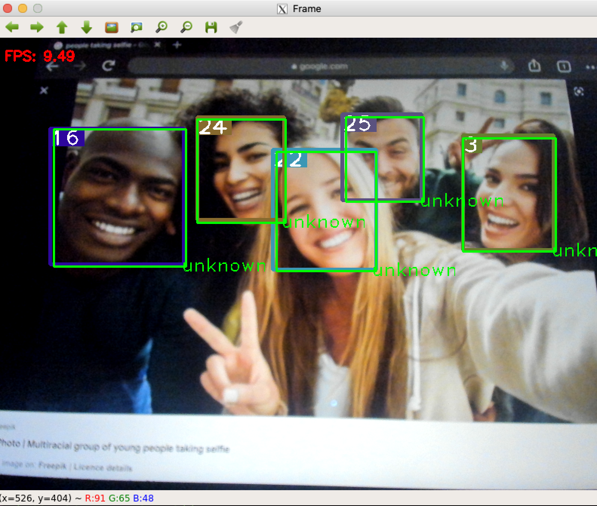
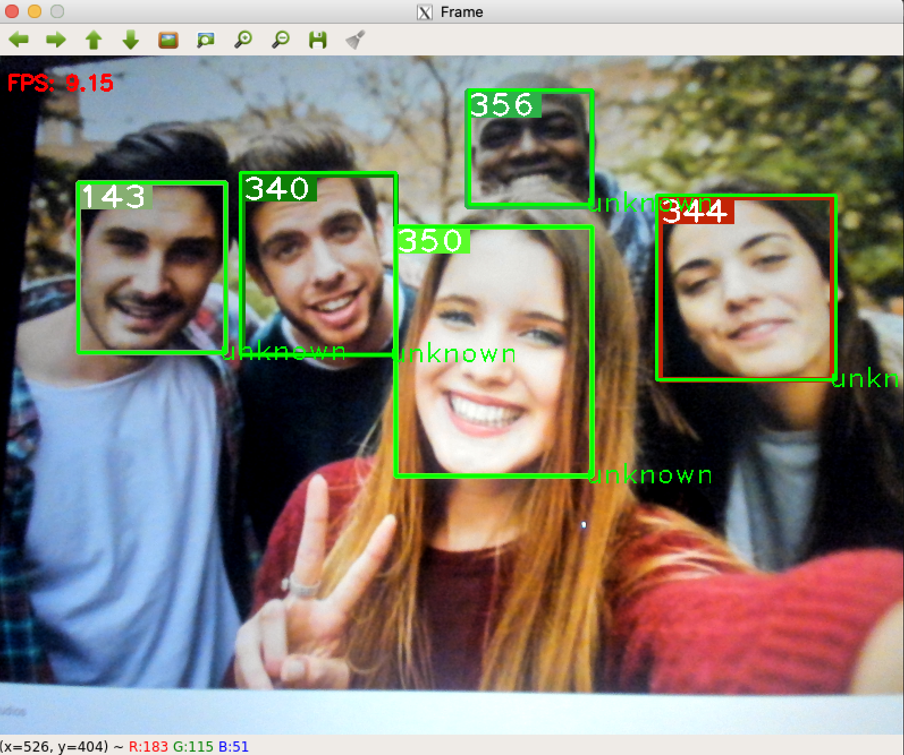
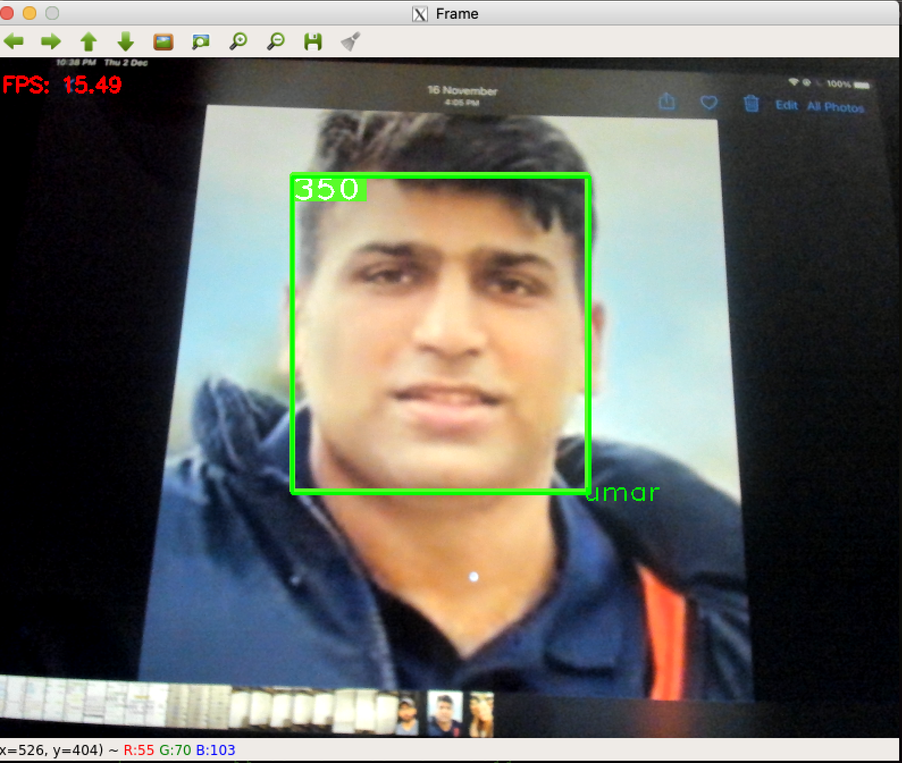
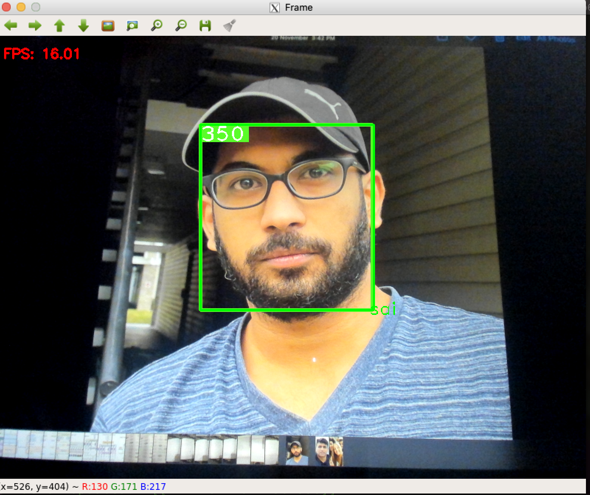
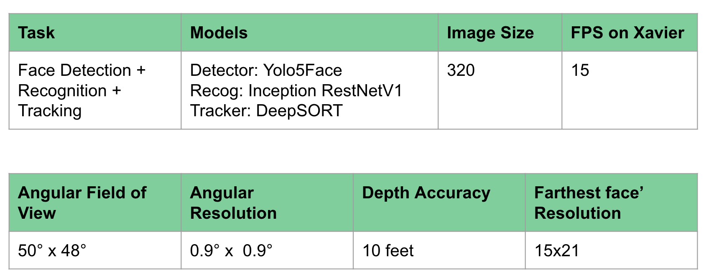

# Face-DTR
This repo performs face detection, recognition and tracking  on Jetson Xavier, with above 15 FPS. 
* Face detection is performed by [Yolo5Face](https://github.com/elyha7/yoloface).
* Face recognition is performed Inception ResNetv3, recognition module from [facenet-pytorch](https://github.com/timesler/facenet-pytorch#use-this-repo-in-your-own-git-project).
* Tracking is performed by DeepSort Tracker from [deep_sort pytorch](https://github.com/ZQPei/deep_sort_pytorch).

</img>
</img>
</img>
</img> 
</img> 

<h2>Detection</h2>

Detection is performed by a wrap over of original github repo for paper [Yolo5Face: Why reinventing a face detector?](https://github.com/deepcam-cn/yolov5-face). This paper implements a yolov5n with wing loss, which is trained over WIDEFace dataset, to perform face detection.
Face detection with this repo was pretty smooth and robust to illumination changes, side poses and varying resolution of faces. 

<h2>Recogntion</h2>

  Recognition is performed using InceptionResNetv3, which is pretrained on VGGFace2, and we finetuned on faces of the people we wanted to recognize, in this case, we were three team members, whose faces we wanted algo to recognize, so we took 40 different images of each person, with varying backgrounds, clothes, illumination and face poses and sizes. In total, this model was fine tuned on 130 images roughly for 30 epochs.  

  Recogniton using above mentioned detector is performed as follows:
  
  * After fine tuning model, 3 different images of each person were passed though the model, one face from front, and other from left anf right side poses, and output of the final layer of trained Inception ResNet are stored in a file.
  * At time of recognition, the detected faces from yolov5 detector are cropped and saved.
  * These cropped faces are passed through this inception resnet to get face embeddings.
  * These embeddings are then compared with the saved embeddings using euclidean distannce. If embeddings of the faces in the frame does not cross similarity threshold person is declared as unnown otherwise, closest embedding are used to assign label.
  
  <h2> Tracking </h2>
  
 
  Tracking is performed by [Deep SORT](https://github.com/nwojke/deep_sort) tracker, which is original SORT (Simple Online Real Time Tracking) tracker plus a deep convolutional network added to it, for improving the tracker's recognition accuracy. Simple SORT tracker uses just kalman filter based predicted state of the tracked object and does not includes any deep representation of the tracked item and hence leads to losing track of objcet for occlusion, or lightning changes. In our case as the side pose or illumination change or scale changes occured, the simple SORT tracker lost object track, and the track disappeared gradually whereas this deep SORT tracker performed really well and did not lose object track.
  

  

  DeepSORT tracker used here, has associated pre-trained convolutional network, for extracing deep representation of the tracked object to improve the mapping of tracked object with detector's detections. This convolutional network was pretrained on human body(pedestrians) not human faces but gave acceptabel performance when we used it for tracking faces.
  

  
  <h2>HardWare SetUp</h2>
  Components used:
  
  * [Jetson Xavier NX](https://www.nvidia.com/en-us/autonomous-machines/embedded-systems/jetson-xavier-nx/)
  * [Logitech BRIO Webcam](https://www.logitech.com/en-us/products/webcams/brio-4k-hdr-webcam.960-001105.html)
  * USB3.0 to connect webcam to Xavier
  
This algorithm is ran on jetson Xavier NX connected to a logitech BRIO usb camera and results were displayed on local system by connecting an ssh tunnel using -X option to the xavier.

  <h2>Acknowledgments</h2>
  
  * [Detection by Yolo5Face](https://github.com/elyha7/yoloface)
  * [Recognition by Recogn module of FaceNet PyTorch](https://github.com/timesler/facenet-pytorch#use-this-repo-in-your-own-git-project)
  * [Tracking from DeepSORT tracker of DeepSORT PyTorch](https://github.com/ZQPei/deep_sort_pytorch)
  
